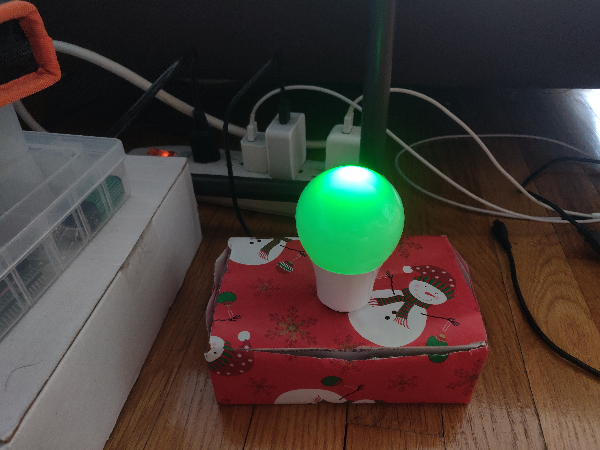
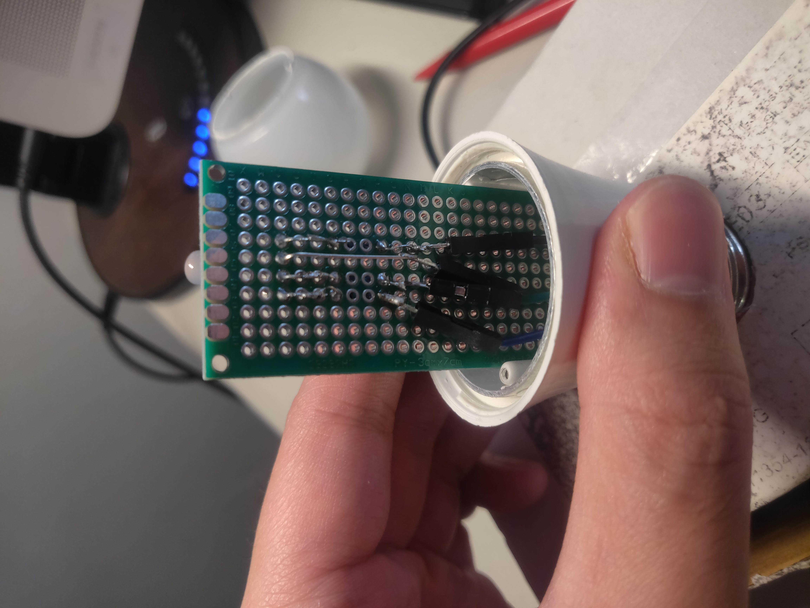

# Senior Design Project 

By using ESP32 with Arduino (C/C++), Sinric (Amazon Alexa), and some tools, our team were able to make a smart LED that costs less than $10 to make. 

Tools used for this project:
<ul>
  <li> <a href="http://esp32.net/" target="_blank">ESP32</a> </li>
  <li> Light Bulb </li>
  <li> RGB LED </li>
  <li> 330 ohm resistors </li>
  <li> Soldering Iron </li>
</ul>

This is what the final product looks like:

  

And this is what the solder looks like:

  

